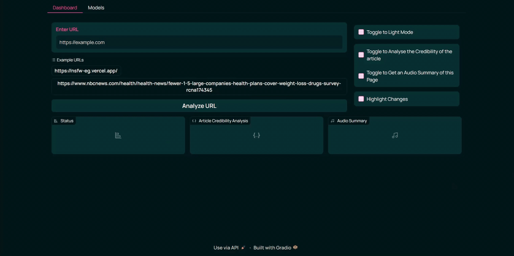

# Arishtha

A 'Content Moderation Tool' utilizing Multimodal Agentic approach which can be embedded within an Browser. Arishtha is designed as a kid-friendly browser, offering a safe browsing experience that appeals to anyone who values online safety. In essence, it addresses a problem that should have been resolved by now.

## Demo



_Figure 1: Demo_


_Figure 2: Process-Flow/Architecture Diagram_

## Video 

[](https://www.youtube.com/watch?v=7g8ghAZ0eKs)

> _Click on the Image_

## About Arishtha

### Functionalities:

Arishta packs a remarkable range of features into its simple design, including:

- **Inappropriate Content Replacement**: Automatically substitutes inappropriate words or hate speech with positive alternatives, with the option to highlight changes via a toggle button.  
- **Custom NSFW Image Replacement**: Replaces NSFW images with user-selected custom images.  
- **Audio Summaries**: Converts webpage content into audio summaries, enabling a podcast-like experience on the go.  
- **Article Credibility Analysis**: Assesses the reliability of articles, including embedded videos.  
- **Dark/Light Mode Toggle**: Offers a built-in dark and light mode toggle that applies to web content as well.  
- **NVIDIA NIM Model Integration**: Allows users to switch between various NVIDIA NIM models seamlessly.  

## Getting Started

### System Requiremnets: 

- **Operating System**:  
  - Windows 11 (version 21H2, build 22000 or higher)  
  - Windows 10 (version 21H2, build 19044 or higher)  

- **Disk Space**:  
  - 1 GB for AI Workbench application  
  - 30-40 GB for containers  

- **Memory**:  
  - 16 GB RAM (preferred)  
  - 8 GB RAM (minimum)  

### Prerequisites:

- Have [NVIDIA AI Workbench](https://www.nvidia.com/en-in/deep-learning-ai/solutions/data-science/workbench/) Program Installed. ([Reference](https://docs.nvidia.com/ai-workbench/user-guide/latest/installation/overview.html))
- [Docker](https://www.docker.com/products/container-runtime/).
- WSL2 ( This will be Installed with the Workbench, if not Installed in prior )

### Secrets:

To run this project, you will be needing the following key and value pairs. Where to add one will be discussed later.

`GEMINI_API_KEY` - This can be accessed from [Google AI Studio](https://aistudio.google.com/app/prompts/new_chat/?utm_source=hackathon&utm_medium=referral&utm_campaign=Devfolio&utm_content=)

`NVIDIA_API_KEY` - This can be accessed from [NVIDIA NIM](https://build.nvidia.com/nim)

`ELEVENLABS_API_KEY` - This can be accessed from [ElevenLabs](https://elevenlabs.io/app/speech-synthesis/text-to-speech)

> Adding all the values are not necessary if you are not using those functionalities. But make sure to add random values and save it, or the **program will not run**.

### Explanation of the Structure:

 **`code/`**:  

- **`audioSum.py`**: Loads the web content (text) using the provided URL, summarizes it, and sends it to ElevenLabs for text-to-speech conversion.  
- **`client.py`**: Handles the Gradio interface and its functions.  
- **`custom_css.py`**: Contains custom CSS for dark and light modes, along with additional design customizations.  
- **`image_model.py`**: Uses the image model to identify NSFW images from the web and replaces them with a user-selected image, ensuring it's Base64 encoded.  
- **`news_fakery.py`**: Utilizes Gemini to determine the credibility of the current web page.  
- **`nvidiaNim.py`**: Configures the four NVIDIA NIM models.  
- **`queuing.py`**: Manages the queuing of data or instructions for analysis, designed for high-load/volume scenarios.  
- **`scrape.py`**: Scrapes the web content for analysis at the start of the process when the URL is entered.  
- **`server.py`**: Handles API inferencing.  
- **`summarizer.py`**: Contains the configuration for the summarization model.  
- **`text_model.py`**: Identifies inappropriate text content and replaces it with positive alternatives.  
- **`video_model.py`**: Analyzes the credibility of videos embedded in articles by downloading the audio, transcribing, summarizing, and sending it to the Gemini model.  
- **`ytlink.py`**: Includes code to search for and download YouTube videos embedded in articles.  

## Run Locally

Open the newly installed NVIDIA AI Workbench from your system and follow the below mentioned comprehensive steps :

### 1. Choosing the Container Runtime :

Choose Docker as your container Runtime.


_Figure 3: Runtime Selection Process_

### 2. Cloning this Repo :

Choose a Location and clone this Repository.

```bash
https://github.com/Avinash-Acharya/Arishtha.git
```


_Figure 4: Cloning This Repository_

### 3. Enter the Secrets:

Navigate to the `Environment` menu towards the left side panel and search for the `Secrets` where you need to enter the API Keys. 


_Figure 5: Adding Secrets_

### 4. Start the Build:

Start the Build process by clicking on `Start Build` button 


_Figure 6: Image before PreBuild_


_Figure 7: Image after PostBuild_

### 5. Run the Application :

Navigate to the `Application` section under `Environment` and Run the Gradio Application by toggling the button.

> **Port:** `http://localhost:10000/projects/Arishtha/applications/Gradio/`


_Figure 8: Running Gradio Application_


>**URL:** `https://nsfw-eg.vercel.app/` ⚠️Harsh Words WARNING!!⚠️
_(This Webpage was built for testing purpose only)_

## License

MIT
